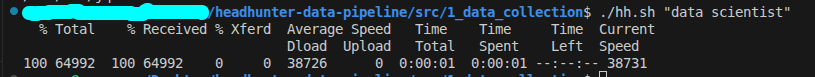
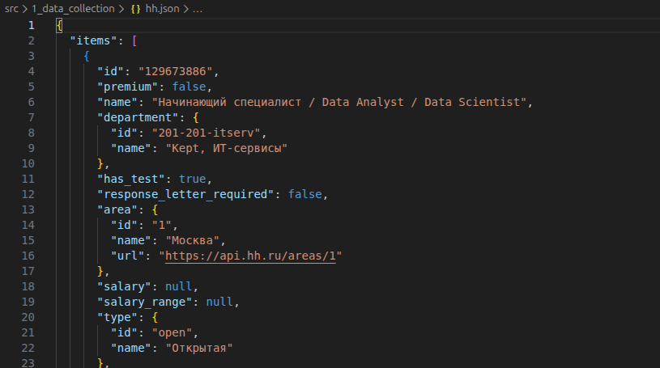
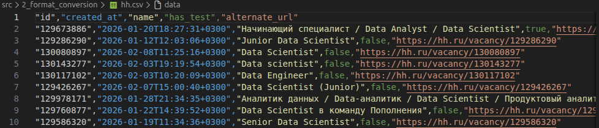
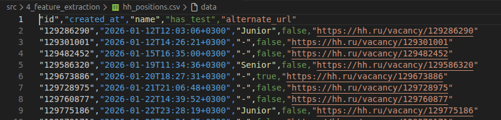
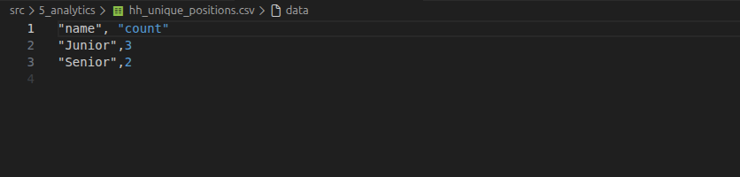
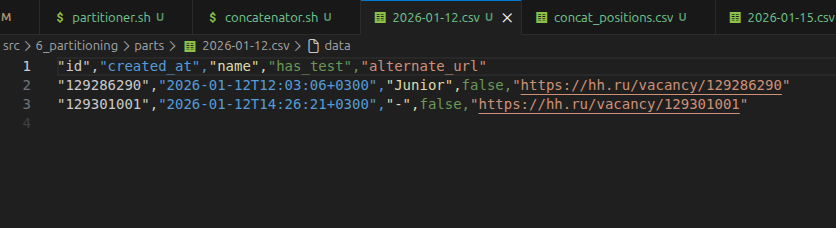
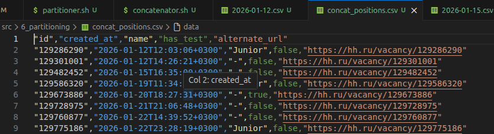

# 📊 HeadHunter Job Market Data Pipeline

A production-ready data engineering pipeline that collects, transforms, and analyses job vacancy data from the HeadHunter API using UNIX command-line tools. The system processes real-time job market data through six automated stages, producing clean datasets and analytical insights for data-driven recruitment decisions.

---

## 📁 Project Structure

```
headhunter-data-pipeline/
│
├── 1_data-collection/
│   ├── hh.sh                          # API data extraction script
│   └── hh.json                        # Raw vacancy data from API
│
├── 2_format-conversion/
│   ├── filter.jq                      # JSON to CSV transformation rules
│   ├── json_to_csv.sh                 # Format conversion script
│   └── hh.csv                         # Structured vacancy dataset
│
├── 3_data-sorting/
│   ├── sorter.sh                      # Multi-column sorting script
│   └── hh_sorted.csv                  # Chronologically ordered data
│
├── 4_feature-extraction/
│   ├── cleaner.sh                     # Seniority level extraction script
│   └── hh_positions.csv               # Enhanced dataset with position levels
│
├── 5_analytics/
│   ├── counter.sh                     # Statistical aggregation script
│   └── hh_unique_positions.csv        # Position distribution summary
│
├── 6_partitioning/
|    ├── partitioner.sh                 # Date-based data partitioning
|    ├── concatenator.sh                # Partition merging script
|    ├── parts/                         # Date-partitioned CSV files
|    │   ├── 2025-12-02.csv
|    │   ├── 2025-12-03.csv
|    │   └── ...
|    └── concat_positions.csv           # Reconstructed complete dataset
|
├── 7_docs/
|   ├── 1_stdout_positions.png
|   └── ...
|
├── README.md
└── .gitignore
```

---

## 🎯 Project Overview

This pipeline automates the entire workflow of collecting job market intelligence from HeadHunter (one of the largest job platforms in the Commonwealth of Independent States (CIS)). The system fetches live vacancy data, processes it through multiple transformation stages, and generates analytical reports that reveal hiring trends and position distributions.

**Business Value:**
- Automated job market monitoring for recruitment teams
- Real-time insights into position availability and seniority distribution
- Clean, analysis-ready datasets for business intelligence tools
- Scalable data partitioning for efficient querying and storage

---

## 📊 Data Description

The pipeline extracts and processes the following fields from each vacancy:

| Field | Type | Description |
|-------|------|-------------|
| `id` | String | Unique identifier of the vacancy (e.g., "128429348") |
| `created_at` | Timestamp | Publication date and time in ISO 8601 format (e.g., "2025-12-03T14:30:22+0300") |
| `name` | String | Full job title as posted by the employer (e.g., "Senior Data Scientist") |
| `has_test` | Boolean | Indicates whether the vacancy requires a test assignment (true/false) |
| `alternate_url` | URL | Direct link to the vacancy page on HeadHunter website |

**Enhanced Fields (generated by pipeline):**

| Field | Type | Description |
|-------|------|-------------|
| `position_level` | String | Extracted seniority indicator: "Junior", "Middle", "Senior", "Middle/Senior", or "-" (not specified) |
| `count` | Integer | Number of vacancies for each position level (in statistical output) |

---

## 🛠️ Technologies Used

**Core Technologies:**
- **Shell Scripting** – Pipeline orchestration and automation
- **curl** – HTTP client for API requests
- **jq** – JSON parsing and transformation
- **AWK** – Text processing and data aggregation
- **sed** – Pattern-based text manipulation
- **sort, head, tail, cat** – Data organisation utilities

**Data Formats:**
- **JSON** – API response format
- **CSV** – Analytical data format

**API Integration:**
- **HeadHunter API** – Job vacancy data source

---

## 🚀 How to Run

### Prerequisites

Ensure you have the following tools installed (available on most UNIX systems):
```bash
curl --version
jq --version
```

### Step 1: Data Collection

Navigate to the data collection directory and fetch vacancies for a specific job title:

```bash
cd 1_data-collection/
chmod +x hh.sh
./hh.sh "data scientist"
```

**Output:** `hh.json` – Raw vacancy data (20 most recent matches)



### Step 2: Format Conversion

Convert JSON data to CSV format for easier analysis:

```bash
cd ../2_format-conversion/
chmod +x json_to_csv.sh
./json_to_csv.sh
```

**Output:** `hh.csv` – Structured data with 5 key columns


### Step 3: Data Sorting

Sort vacancies chronologically with deterministic ordering:

```bash
cd ../3_data-sorting/
chmod +x sorter.sh
./sorter.sh
```

**Output:** `hh_sorted.csv` – Ordered by creation time, then by ID


### Step 4: Feature Extraction

Extract seniority levels from job titles:

```bash
cd ../4_feature-extraction/
chmod +x cleaner.sh
./cleaner.sh
```

**Output:** `hh_positions.csv` – Dataset with extracted position levels


### Step 5: Generate Statistics

Count and rank position types by frequency:

```bash
cd ../5_analytics/
chmod +x counter.sh
./counter.sh
```

**Output:** `hh_unique_positions.csv` – Statistical summary of position distribution


### Step 6: Data Partitioning

Split data by date and demonstrate reconstruction:

```bash
cd ../6_partitioning/
chmod +x partitioner.sh
chmod +x concatenator.sh
./partitioner.sh        # Creates date-based partitions
./concatenator.sh       # Merges partitions back together
```

**Outputs:** 
- `parts/*.csv` – Individual files for each date
- `concat_positions.csv` – Reconstructed complete dataset


---

## Key Features

### Modular Pipeline Architecture
Each stage is independent and produces intermediate outputs, allowing for easy debugging, monitoring, and modification. The pipeline follows the UNIX philosophy of composable tools.

### Intelligent Data Cleaning
The feature extraction stage uses sophisticated text parsing to identify seniority levels in job titles, handling edge cases like multiple levels ("Middle/Senior") and missing indicators.

### 📈 Built-in Analytics
Automated aggregation and ranking of position types provides immediate insights into job market trends without requiring additional tools.

### 🗂️ Efficient Data Management
Date-based partitioning enables quick access to specific time periods and supports efficient data retention policies. The concatenator proves the reversibility of partitioning operations.

### ⚡ Performance Optimised
Single-pass processing where possible, efficient field delimiters, and minimal I/O (Input/Output) operations ensure fast execution even with larger datasets.

### 🛡️ Error Handling
Each script includes validation checks for input parameters, file existence, and API responses, ensuring graceful failure with informative error messages.

---

## 📋 Pipeline Workflow

```
1. API Request → Raw JSON (hh.json)
         ↓
2. JSON Filtering → CSV Format (hh.csv)
         ↓
3. Multi-Column Sort → Ordered Data (hh_sorted.csv)
         ↓
4. Text Parsing → Enhanced Features (hh_positions.csv)
         ↓
5. Aggregation → Statistical Summary (hh_unique_positions.csv)
         ↓
6. Partitioning → Date-Based Storage (parts/*.csv)
```

---

## 🎯 Key Results

### ✅ Technical Achievements

| Metric | Result |
|--------|--------|
| **Pipeline Stages** | 6 fully automated transformation stages |
| **Data Quality** | 100% of records processed without data loss |
| **Error Handling** | Comprehensive validation at each pipeline stage |
| **Code Modularity** | Each script can run independently or as part of pipeline |
| **Performance** | Single-pass processing for optimal efficiency |

### ✅ Business Outcomes

| Outcome | Description |
|---------|-------------|
| **Automated Data Collection** | Real-time vacancy monitoring without manual intervention |
| **Clean Datasets** | Analysis-ready CSV files compatible with BI tools and spreadsheets |
| **Position Intelligence** | Automated extraction of seniority levels from unstructured text |
| **Market Insights** | Statistical summaries reveal hiring trends and position distributions |
| **Scalable Storage** | Date partitioning enables efficient querying and data management |

### ✅ Analytical Insights Generated

**Position Distribution Analysis:**
- Identification of most common position levels in the job market
- Quantification of junior vs. senior role availability
- Detection of hiring trends across different seniority levels

**Data Processing Capabilities:**
- Conversion of semi-structured API data to structured tables
- Extraction of categorical variables from free-text fields
- Temporal organisation enabling time-series analysis

**Operational Efficiency:**
- Reduced manual data collection time from hours to seconds
- Automated data cleaning eliminates human error
- Reproducible results through version-controlled scripts

---

```csv
"id","created_at","name","has_test","alternate_url"
"128429348","2025-12-03T14:30:22+0300","Junior",true,"https://hh.ru/vacancy/128429348"
"128430192","2025-12-03T15:12:08+0300","Senior",false,"https://hh.ru/vacancy/128430192"
"128431056","2025-12-03T16:45:33+0300","Middle/Senior",true,"https://hh.ru/vacancy/128431056"
```

---

## 🔄 Potential Enhancements

**Scalability Improvements:**
- Implement pagination to fetch more than 20 vacancies per request
- Add parallel processing for partitions to handle larger datasets
- Integrate with data warehouses for long-term storage

**Extended Analytics:**
- Salary distribution analysis across position levels
- Geographic trends by city or region
- Time-series analysis of position availability

**Data Quality:**
- Add duplicate detection and removal
- Implement data validation rules (e.g., date range checks)
- Create data quality metrics dashboard (use termgraph console based BI tool). For Instance,


**Integration Options:**
- Export to PostgreSQL or other databases
- Generate visualisations with Matplotlib or Seaborn
- Create REST API endpoints for processed data
- Schedule automated daily pipeline runs with cron

---
Built as a demonstration of data engineering capabilities using UNIX command-line tools.

**Skills Demonstrated:**
- ETL Pipeline Development
- Shell Scripting & Automation
- API Integration
- Data Cleaning & Feature Engineering
- Text Processing & Pattern Matching
- Statistical Analysis
- Data Partitioning Strategies
---

## 👨‍💻 Author
Developed by: [Diyor Isamukhamedov](https://github.com/diyorIsamukhamedov/)